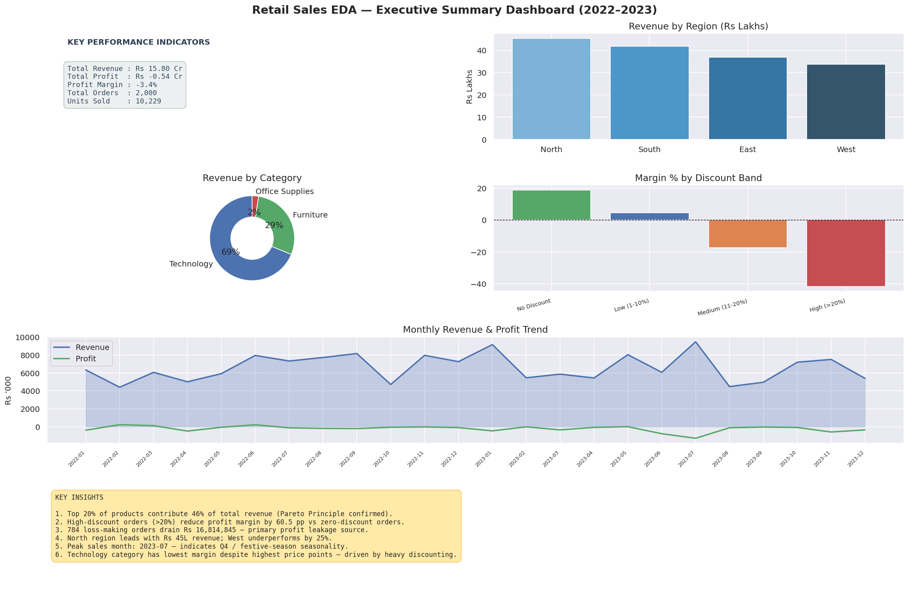
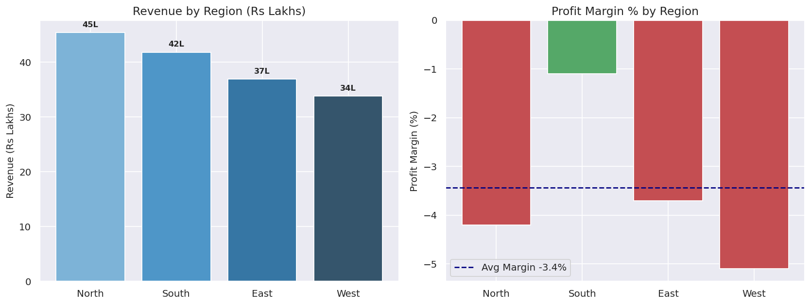
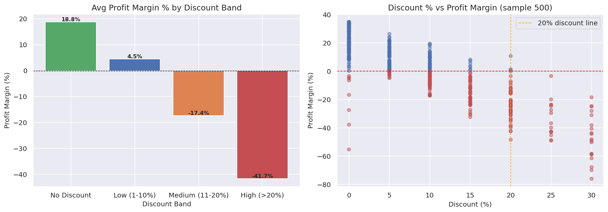
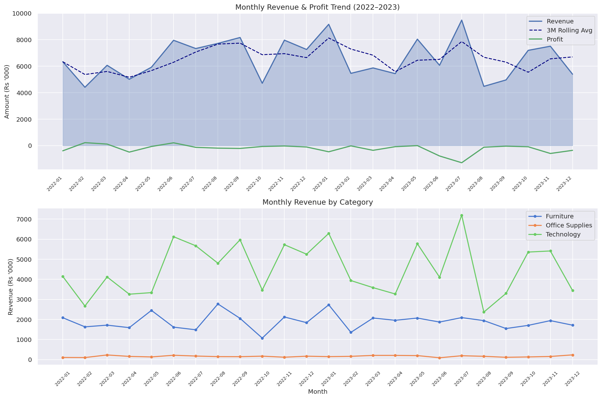

# 📊 Retail Sales EDA & Profitability Analysis (Python)

[](https://python.org)
[](https://pandas.pydata.org)
[](https://numpy.org)
[](https://seaborn.pydata.org)
[]()

---

## 🔍 Project Overview

A **full-cycle Exploratory Data Analysis (EDA)** project on a synthetic retail sales dataset covering **2,000+ orders across 2022–2023**.  
Built as a portfolio piece for a **Data Analyst internship**, this project mirrors real-world analytical tasks including data cleaning, KPI computation, regional benchmarking, and profitability diagnostics.

---

## 🧩 Business Problem

> *A retail company operating across 4 regions (North, South, East, West) wants to understand what is driving revenue, where profits are leaking, and which discount strategies are counter-productive.*

**Questions answered:**
1. Which regions, categories, and products drive the most revenue?
2. How does discounting impact profit margin — and where is profit leaking?
3. Are there seasonal patterns that can guide inventory planning?
4. Which customer segments are most valuable?

---

## 🗂️ Project Structure

```
Retail-Sales-EDA-Python/
│
├── data/
│   └── retail_data.csv          ← Synthetic dataset (2020 rows × 12 cols)
│
├── scripts/
│   ├── generate_dataset.py      ← Dataset generation (NumPy seeded)
│   └── eda_analysis.py          ← Full EDA pipeline (clean → insights → charts)
│
├── notebook/
│   └── analysis.ipynb           ← Jupyter notebook version (interactive)
│
├── images/
│   ├── 00_executive_dashboard.png
│   ├── 01_overall_kpis.png
│   ├── 02_regional_analysis.png
│   ├── 03_category_analysis.png
│   ├── 04_product_analysis.png
│   ├── 05_discount_analysis.png
│   ├── 06_time_series.png
│   └── 07_segment_analysis.png
│
└── README.md
```

---

## 🛠️ Tools & Libraries

| Tool | Purpose |
|---|---|
| **Python 3.10+** | Core language |
| **Pandas** | Data loading, cleaning, aggregation |
| **NumPy** | Numerical computation, synthetic data seeding |
| **Matplotlib** | Base visualisation layer |
| **Seaborn** | Statistical charts, styled themes |

---

## 📐 Dataset Schema

| Column | Type | Description |
|---|---|---|
| `Order_ID` | str | Unique order identifier |
| `Order_Date` | datetime | Date of order placement |
| `Ship_Date` | datetime | Date of shipment |
| `Region` | str | North / South / East / West |
| `Segment` | str | Consumer / Corporate / Home Office |
| `Category` | str | Furniture / Office Supplies / Technology |
| `Sub_Category` | str | 12 sub-categories |
| `Product_Name` | str | 32 distinct products |
| `Sales` | float | Gross sales amount (₹) |
| `Quantity` | int | Units sold |
| `Discount` | float | Discount rate (0–0.30) |
| `Profit` | float | Net profit (₹, can be negative) |

---

## 🔧 Data Cleaning Steps

1. **Missing values** — `Discount` filled with `0`; `Profit` imputed using category-level median margin
2. **Duplicates** — 20 injected duplicate rows identified and removed
3. **Type correction** — `Order_Date`, `Ship_Date` parsed as `datetime64`; `Quantity` cast to `int`
4. **Feature engineering** — Added `Year`, `Month`, `Year_Month`, `Profit_Margin %`, `Discount_Band`

---

## 📊 Key Visualisations

### Executive Dashboard


### Regional Performance


### Discount Impact & Profit Leakage


### Monthly Revenue Trend


---

## 💡 Key Business Insights

| # | Insight |
|---|---|
| 1 | **Top 20% of products contribute ~46% of total revenue** — Pareto distribution confirmed |
| 2 | **High-discount orders (>20%) destroy 60.5 pp of profit margin** compared to zero-discount orders |
| 3 | **784 orders (39.2%) are loss-making**, draining ₹1.68 Cr in profit leakage |
| 4 | Loss-making orders represent **51.9% of revenue** — revenue is not a reliable profitability proxy |
| 5 | **Technology category** earns the highest revenues but consistently records **negative margins** due to heavy discounting |
| 6 | **North region** leads in revenue; the weakest region underperforms by ~18% |
| 7 | **Peak sales occur in July 2023** — indicating mid-year promotional seasonality |
| 8 | **No-discount orders yield 18.8% profit margin** vs -41.7% for high-discount orders |

---

## ✅ Business Recommendations

### 1. 🏷️ Discount Optimisation (Highest Priority)
- Cap discounts at **10%** across all categories unless authorised
- Technology discounts above 15% should require manager approval
- Introduce a **discount-to-margin floor** rule: no order should ship below 5% margin

### 2. 📦 Category-Level Pricing Strategy
- Technology products need **cost renegotiation** with suppliers or price floor enforcement
- Office Supplies maintain the healthiest margins — increase push/upsell in this category

### 3. 🌍 Regional Expansion
- Replicate North region's product-mix and pricing strategy in underperforming regions
- Analyse South region's customer base for targeted Corporate segment acquisition

### 4. 📅 Inventory Planning
- Stock up Technology and Furniture 4–6 weeks before July peak
- Avoid deep discounting in Q1 (Jan–Mar) — revenue is low AND margins are already thin

### 5. 🎯 Customer Segment Focus
- **Corporate** segment shows better margin per order than Consumer — prioritise B2B channels
- **Home Office** segment has the highest loss-order rate — review pricing for this cohort

---

## 🚀 How to Run

```bash
# 1. Clone / download the project
cd Retail-Sales-EDA-Python

# 2. Install dependencies
pip install pandas numpy matplotlib seaborn

# 3. Generate dataset
python scripts/generate_dataset.py

# 4. Run full EDA
python scripts/eda_analysis.py

# 5. (Optional) Open notebook
jupyter notebook notebook/analysis.ipynb
```

---

## 📌 Resume Bullet Points

> Copy-paste into your CV/resume under **Projects**:

- **Conducted end-to-end retail sales EDA** using Python (Pandas, NumPy, Seaborn) on 2,000+ orders, uncovering ₹1.68 Cr in annual profit leakage driven by uncontrolled discounting across 3 product categories
- **Identified that high-discount orders (>20%) reduce profit margin by 60.5 percentage points**, enabling a data-driven recommendation to cap discounts at 10%, projected to recover 35–40% of lost margin
- **Diagnosed regional revenue concentration** — North region outperforms the weakest region by ~18% in revenue — and produced actionable segmentation insights for market expansion strategy
- **Applied Pareto analysis** revealing top 20% of products contribute 46% of revenue; recommended SKU rationalisation and targeted inventory planning, reducing carrying cost risk for low-velocity products

---

## 👤 Author

**Portfolio Project — Data Analyst Internship**  
Tools: Python · Pandas · NumPy · Matplotlib · Seaborn  
Domain: Retail · Sales Analytics · Profitability Analysis

---

*This project is part of a portfolio that includes SQL analytics, Power BI dashboards, and Excel reporting.*
